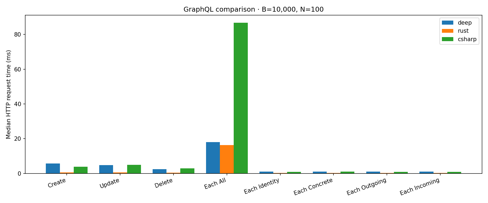
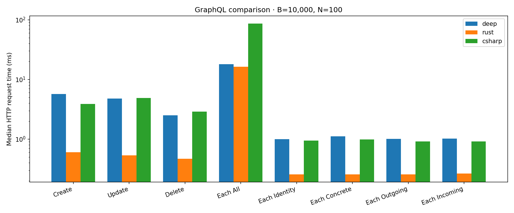
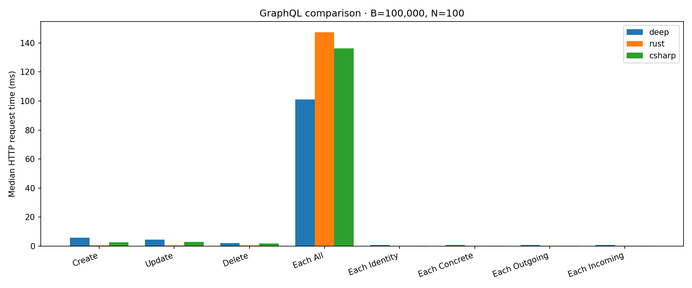
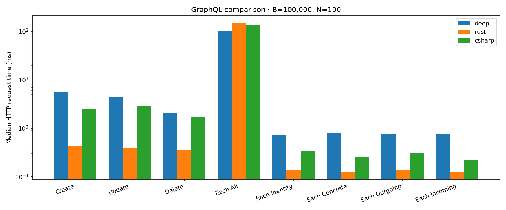
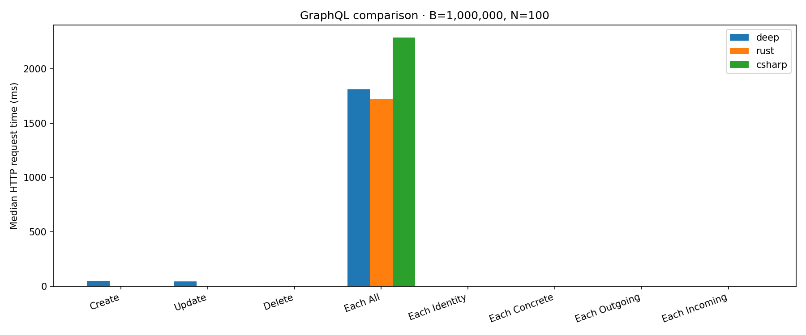
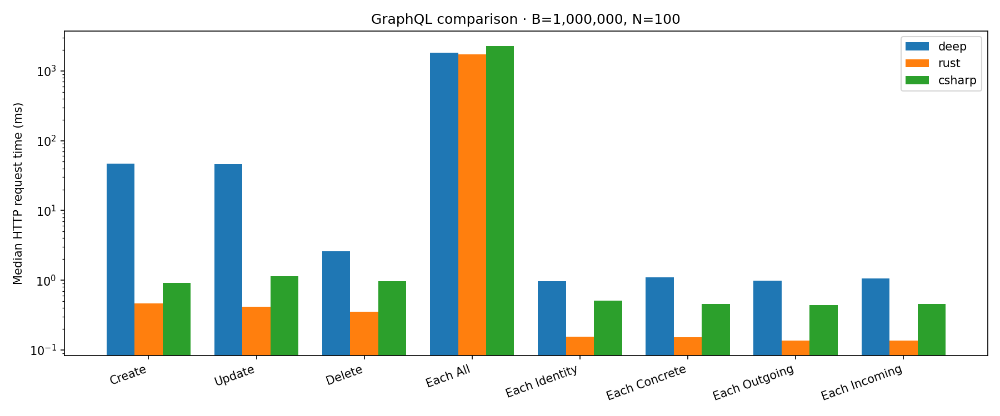

# GraphQL server comparison

Deep's PostgreSQL + Hasura core links storage versus Doublets Rust and Doublets C#,
through the same GraphQL-over-HTTP workload. This repository now contains runnable
servers, correctness tests, a benchmark driver and generated reporting.

## Scope and schema

[`schema/links.graphql`](schema/links.graphql) defines the executable common subset
of the [Data.Doublets.Gql](https://github.com/linksplatform/Data.Doublets.Gql) /
Hasura API: `links`, `insert_links`, `update_links`, `delete_links`, with `id`,
`from_id`, `to_id`, equality, membership, range and boolean filters, ordering by
id, limit and offset. Rust uses async-graphql + Axum over `doublets` 0.5.0;
C# uses GraphQL.NET over `Platform.Data.Doublets` 0.18.1. Both use united volatile
Doublets stores and push equality and id-membership filters into their native indexes.
The adapters follow Data.Doublets.Gql's field and resolver conventions; they are
maintained in `rust/` and `csharp/` here because its legacy servers require old
runtimes and have unfinished resolvers. All original submodule pointers remain.

The Deep baseline uses PostgreSQL 16.13 and Hasura 2.48.13, both pinned by digest
in [`compose.yml`](compose.yml). [`deep/links.sql`](deep/links.sql) reproduces the
core table and indexes from [Deep's links migration at
381207d](https://github.com/deep-foundation/deeplinks/blob/381207dda313ab3c1fed0a4bfc2ddbe631750411/migrations/1616701513782-links.ts),
with a default `type_id = 0`. This compares core links storage, without Deep's
application triggers, permissions, values, relationships, materialized paths or
subscriptions. Hasura exposes more schema fields than the common subset.

Workloads use nonnegative, non-null endpoints and distinct `(from_id, to_id)`
pairs. They do not benchmark duplicates, explicit ids, nullable endpoints,
transactions or concurrency. Generated ids can be reused by Doublets and are
monotonic in PostgreSQL; tests start with fresh stores and benchmarks use ids
returned by each server. The comparison does not claim equivalence outside this
shared workload domain.

## Running locally

Prerequisites: Docker with Compose, Rust 1.98.0, .NET SDK 10.0.112 (runtime 10.0.12), and Python
3.12 or newer. Versions of libraries are pinned in Cargo.lock and
packages.lock.json; reporting dependencies are in requirements.txt.

```bash
python3 -m pip install -r requirements.txt
cargo build --manifest-path rust/Cargo.toml --release --locked
dotnet restore csharp/Doublets.Gql.csproj --locked-mode
dotnet build csharp/Doublets.Gql.csproj -c Release --no-restore

# Unit tests and the same-response test against all three real HTTP servers.
python3 -m unittest discover -s tests -v
cargo test --manifest-path rust/Cargo.toml --release --locked
python3 -m scripts.run conformance

# Each command starts an empty dedicated backend and cleans up after itself.
export BENCHMARK_BACKGROUND_LINKS=1000 BENCHMARK_LINKS=10
export BENCHMARK_SAMPLES=10 BENCHMARK_WARMUP=2
python3 -m scripts.run benchmark --backend deep
python3 -m scripts.run benchmark --backend rust
python3 -m scripts.run benchmark --backend csharp
python3 -m scripts.report results --readme README.md --charts Docs
```

`python3 -m scripts.run` owns ports 8080, 8001 and 8002, starts only the required
servers, saves server logs under `results/logs/`, and stops its processes and
Compose services on completion or failure. Use a dedicated checkout and database;
Compose teardown removes its database. The low-level driver also accepts an
existing **empty dedicated** endpoint:
`python3 -m scripts.workload rust http://127.0.0.1:8001/v1/graphql results/rust-1000.json`.
It refuses to seed a nonempty store. Set `BENCHMARK_TRACE=1` for optional HTTP
tracing (off by default; trace runs should not be used for published timings).
Set `COMPOSE_OVERRIDE` to an optional local Compose override file if needed.

| Environment variable | Default | Meaning |
|---|---:|---|
| `BENCHMARK_BACKGROUND_LINKS` | 1000 | B, links seeded outside timing |
| `BENCHMARK_LINKS` | 100 | N, links affected by a mutation request |
| `BENCHMARK_SAMPLES` | 10 | Measured requests per operation (2–1000) |
| `BENCHMARK_WARMUP` | 2 | Untimed requests per operation (0–100) |
| `LISTEN_ADDRESS` | Rust: `127.0.0.1:8001`; C#: `http://127.0.0.1:8002` | Adapter bind address |

Require `1 ≤ N ≤ B ≤ 1,000,000` and `B + N < 1,040,384`, the capacity limit of
Rust doublets 0.5.0 described by the [sibling comparison](https://github.com/linksplatform/Comparisons.Neo4jVSDoublets/tree/main/experiments/store-capacity).
Servers are bounded to 4 GiB virtual memory (Rust), 2 GiB managed heap (C#),
and 2 GiB per database container; Rust's stack limit is 32 MiB.

| Operation | Shared request and dataset |
|---|---|
| Create | Insert N temporary pairs `(i, i)`; delete returned ids after timing |
| Update | Set `to_id = 1` for N background ids; restore each original pair after timing |
| Delete | Insert N temporary pairs outside timing, delete their returned ids |
| Each All | Query and order all B background links |
| Each Identity | Query one background id |
| Each Concrete | Query `from_id = 1` and `to_id = 2` |
| Each Outgoing | Query `from_id = 1` |
| Each Incoming | Query `to_id = 2` |

Background pairs are `(i, i+1)`, so each filtered query returns one row.
Create/update/delete each send **one batched HTTP request**, not N requests.
The driver uses one persistent HTTP connection and exactly the same documents,
variables and settings for every server. Each sample includes client JSON
encoding/decoding, HTTP, GraphQL parsing/validation/execution, storage and response
serialization. Setup, seeding, warm-up, response validation and mutation cleanup are untimed. Each
response is checked for the expected affected count, ids and endpoints before it
can become a sample. The complete background dataset is checked again at the end. These are end-to-end
server comparisons, not isolated storage or language-speed measurements; Hasura's
query-plan caching and PostgreSQL durability differ from volatile Doublets.

Rust uses the united store because the split store in doublets 0.5.0 hangs during
repeated batched mutations on non-point links. A bounded regression test
(`repeated_batch_mutations_preserve_indexes`, 5 seconds) reproduces this failure
and verifies the chosen store. `python3 -m experiments.repeat_workload` retains
the small HTTP reproduction (1,000 background links, 3 samples, memory/CPU limits).

The conformance test checks explicit expected responses and compares all three
servers: every query variant, membership/range/boolean filters, pagination,
partial updates, missing ids, batched deletes and final state. The Python tests
check workload bounds, timing boundaries and reporting validation/ratios. Rust
also tests repeated mutations, partial updates and negative identity lookups. Local CI checks:

```bash
ruff check scripts tests
python3 -m unittest discover -s tests -v
cargo fmt --manifest-path rust/Cargo.toml --check
cargo clippy --manifest-path rust/Cargo.toml --release --all-targets --locked -- -D warnings
dotnet format csharp/Doublets.Gql.csproj --verify-no-changes --no-restore
```

## CI and results

[`.github/workflows/benchmarks.yml`](.github/workflows/benchmarks.yml) checks
formatting, lint, builds, unit tests and real three-server conformance first.
Benchmark jobs then use a **server × B** matrix: Deep, Rust and C#, each in its
own runner. PRs use `B = 1,000`, `N = 10`; main and manual main runs use
`B = 10,000 / 100,000 / 1,000,000`, `N = 100`. All use 10 measured samples and
2 warm-up requests per operation. There are path filters, branch concurrency,
explicit job timeouts and pinned actions, toolchains and database images.

Every successful run uploads raw samples, logs and a generated README with
linear and log charts. CI commits README, charts and raw samples under
`Docs/results/` only on main. It changes only the results markers below and
rejects incomplete backends/operations, duplicate results, inconsistent workloads,
missing provenance and invalid statistics. Generated-result-only commits do not
match the workflow's path filters. Times show sample medians and standard
deviations, ratios to Deep (`× faster`, `× slower`, `≈ same`), dependency versions,
CPU, commit, run link and UTC date. Treat overlapping error ranges or differences
under 5% as approximately the same.

<!-- results:start -->
Times are medians per HTTP request (including client encoding/decoding, network, GraphQL and storage); ± values are sample standard deviations. Ratios compare each Doublets server with Deep. Differences below 5% or overlapping ±1 SD ranges are shown as ≈ same.

### B = 10,000, N = 100

10 samples after 2 warm-up requests per operation. Create/update/delete act on N links; Each All returns B links; the other queries return one link.

- **deep**: deep-core-schema 381207dda313ab3c1fed0a4bfc2ddbe631750411, hasura v2.48.13, image-hasura/graphql-engine hasura/graphql-engine:v2.48.13@sha256:224f4239b28583413b2a0ace7193c467d81f28d791dc8c65597ed11b2cd83123, image-postgres postgres:16.13-alpine@sha256:4e6e670bb069649261c9c18031f0aded7bb249a5b6664ddec29c013a89310d50, postgres 16.13-alpine, python 3.12.14; CPU: AMD EPYC 7763 64-Core Processor; 2026-10-07T00:31:41.380314+00:00; [run](https://github.com/linksplatform/Comparisons.DeepGqlStandard/actions/runs/37552205185); commit `9e4f90a2a7eecdeab9b7388b05920764f5ca3991`.
- **rust**: async-graphql 7.0.17, axum 0.8.4, doublets 0.5.0, python 3.12.15, rust 1.98.0; CPU: AMD EPYC 7763 64-Core Processor; 2026-10-07T00:32:39.480072+00:00; [run](https://github.com/linksplatform/Comparisons.DeepGqlStandard/actions/runs/37552205185); commit `9e4f90a2a7eecdeab9b7388b05920764f5ca3991`.
- **csharp**: GraphQL 8.8.5, GraphQL.SystemTextJson 8.8.5, Platform.Data.Doublets 0.18.1, dotnet-runtime 10.0.12, dotnet-sdk 10.0.112, python 3.12.14; CPU: AMD EPYC 7763 64-Core Processor; 2026-10-07T00:31:53.263207+00:00; [run](https://github.com/linksplatform/Comparisons.DeepGqlStandard/actions/runs/37552205185); commit `9e4f90a2a7eecdeab9b7388b05920764f5ca3991`.

| Operation | Deep (PostgreSQL + Hasura) | Doublets Rust | Doublets C# |
|---|---:|---:|---:|
| Create | 5.68 ms ± 132 µs | 600 µs ± 18 µs (**9.46× faster**) | 3.89 ms ± 105 µs (**1.46× faster**) |
| Update | 4.76 ms ± 411 µs | 537 µs ± 23.3 µs (**8.87× faster**) | 4.88 ms ± 773 µs (**≈ same**) |
| Delete | 2.5 ms ± 142 µs | 468 µs ± 15.5 µs (**5.34× faster**) | 2.88 ms ± 21.5 µs (**1.15× slower**) |
| Each All | 18 ms ± 401 µs | 16.4 ms ± 251 µs (**1.1× faster**) | 86.7 ms ± 7.45 ms (**4.83× slower**) |
| Each Identity | 1 ms ± 127 µs | 257 µs ± 9.64 µs (**3.9× faster**) | 947 µs ± 23.3 µs (**≈ same**) |
| Each Concrete | 1.11 ms ± 68.7 µs | 258 µs ± 7.14 µs (**4.32× faster**) | 986 µs ± 81.1 µs (**≈ same**) |
| Each Outgoing | 1.01 ms ± 119 µs | 256 µs ± 26.3 µs (**3.94× faster**) | 916 µs ± 29.3 µs (**≈ same**) |
| Each Incoming | 1.02 ms ± 89.6 µs | 264 µs ± 28.7 µs (**3.85× faster**) | 916 µs ± 11.5 µs (**≈ same**) |





### B = 100,000, N = 100

10 samples after 2 warm-up requests per operation. Create/update/delete act on N links; Each All returns B links; the other queries return one link.

- **deep**: deep-core-schema 381207dda313ab3c1fed0a4bfc2ddbe631750411, hasura v2.48.13, image-hasura/graphql-engine hasura/graphql-engine:v2.48.13@sha256:224f4239b28583413b2a0ace7193c467d81f28d791dc8c65597ed11b2cd83123, image-postgres postgres:16.13-alpine@sha256:4e6e670bb069649261c9c18031f0aded7bb249a5b6664ddec29c013a89310d50, postgres 16.13-alpine, python 3.12.14; CPU: AMD EPYC 9V45 96-Core Processor; 2026-10-07T00:31:53.862066+00:00; [run](https://github.com/linksplatform/Comparisons.DeepGqlStandard/actions/runs/37552205185); commit `9e4f90a2a7eecdeab9b7388b05920764f5ca3991`.
- **rust**: async-graphql 7.0.17, axum 0.8.4, doublets 0.5.0, python 3.12.15, rust 1.98.0; CPU: INTEL(R) XEON(R) PLATINUM 8573C; 2026-10-07T00:32:37.575773+00:00; [run](https://github.com/linksplatform/Comparisons.DeepGqlStandard/actions/runs/37552205185); commit `9e4f90a2a7eecdeab9b7388b05920764f5ca3991`.
- **csharp**: GraphQL 8.8.5, GraphQL.SystemTextJson 8.8.5, Platform.Data.Doublets 0.18.1, dotnet-runtime 10.0.12, dotnet-sdk 10.0.112, python 3.12.14; CPU: AMD EPYC 9V45 96-Core Processor; 2026-10-07T00:31:47.508756+00:00; [run](https://github.com/linksplatform/Comparisons.DeepGqlStandard/actions/runs/37552205185); commit `9e4f90a2a7eecdeab9b7388b05920764f5ca3991`.

| Operation | Deep (PostgreSQL + Hasura) | Doublets Rust | Doublets C# |
|---|---:|---:|---:|
| Create | 5.65 ms ± 417 µs | 426 µs ± 48.9 µs (**13.3× faster**) | 2.48 ms ± 41.2 µs (**2.28× faster**) |
| Update | 4.51 ms ± 22.8 ms | 398 µs ± 32.3 µs (**≈ same**) | 2.89 ms ± 97.6 µs (**≈ same**) |
| Delete | 2.1 ms ± 140 µs | 362 µs ± 19.1 µs (**5.81× faster**) | 1.67 ms ± 162 µs (**1.26× faster**) |
| Each All | 101 ms ± 1.87 ms | 147 ms ± 4.6 ms (**1.46× slower**) | 136 ms ± 9.5 ms (**1.35× slower**) |
| Each Identity | 719 µs ± 107 µs | 140 µs ± 14.2 µs (**5.14× faster**) | 340 µs ± 36.4 µs (**2.11× faster**) |
| Each Concrete | 810 µs ± 75.2 µs | 128 µs ± 12.2 µs (**6.34× faster**) | 251 µs ± 84.2 µs (**3.23× faster**) |
| Each Outgoing | 752 µs ± 78.5 µs | 136 µs ± 8.12 µs (**5.51× faster**) | 313 µs ± 10.2 µs (**2.4× faster**) |
| Each Incoming | 769 µs ± 75.1 µs | 125 µs ± 9.11 µs (**6.15× faster**) | 222 µs ± 35.2 µs (**3.47× faster**) |





### B = 1,000,000, N = 100

10 samples after 2 warm-up requests per operation. Create/update/delete act on N links; Each All returns B links; the other queries return one link.

- **deep**: deep-core-schema 381207dda313ab3c1fed0a4bfc2ddbe631750411, hasura v2.48.13, image-hasura/graphql-engine hasura/graphql-engine:v2.48.13@sha256:224f4239b28583413b2a0ace7193c467d81f28d791dc8c65597ed11b2cd83123, image-postgres postgres:16.13-alpine@sha256:4e6e670bb069649261c9c18031f0aded7bb249a5b6664ddec29c013a89310d50, postgres 16.13-alpine, python 3.12.14; CPU: AMD EPYC 7763 64-Core Processor; 2026-10-07T00:36:13.479168+00:00; [run](https://github.com/linksplatform/Comparisons.DeepGqlStandard/actions/runs/37552205185); commit `9e4f90a2a7eecdeab9b7388b05920764f5ca3991`.
- **rust**: async-graphql 7.0.17, axum 0.8.4, doublets 0.5.0, python 3.12.15, rust 1.98.0; CPU: INTEL(R) XEON(R) PLATINUM 8573C; 2026-10-07T00:33:07.486128+00:00; [run](https://github.com/linksplatform/Comparisons.DeepGqlStandard/actions/runs/37552205185); commit `9e4f90a2a7eecdeab9b7388b05920764f5ca3991`.
- **csharp**: GraphQL 8.8.5, GraphQL.SystemTextJson 8.8.5, Platform.Data.Doublets 0.18.1, dotnet-runtime 10.0.12, dotnet-sdk 10.0.112, python 3.12.14; CPU: AMD EPYC 7763 64-Core Processor; 2026-10-07T00:32:32.760691+00:00; [run](https://github.com/linksplatform/Comparisons.DeepGqlStandard/actions/runs/37552205185); commit `9e4f90a2a7eecdeab9b7388b05920764f5ca3991`.

| Operation | Deep (PostgreSQL + Hasura) | Doublets Rust | Doublets C# |
|---|---:|---:|---:|
| Create | 46.9 ms ± 2.51 ms | 462 µs ± 25.6 µs (**101× faster**) | 911 µs ± 51.6 µs (**51.5× faster**) |
| Update | 46.4 ms ± 471 µs | 419 µs ± 19.9 µs (**111× faster**) | 1.14 ms ± 222 µs (**40.6× faster**) |
| Delete | 2.6 ms ± 465 µs | 350 µs ± 22.2 µs (**7.42× faster**) | 975 µs ± 761 µs (**2.67× faster**) |
| Each All | 1.81 s ± 20 ms | 1.73 s ± 68.7 ms (**≈ same**) | 2.29 s ± 152 ms (**1.26× slower**) |
| Each Identity | 970 µs ± 131 µs | 155 µs ± 18.5 µs (**6.26× faster**) | 511 µs ± 50.2 µs (**1.9× faster**) |
| Each Concrete | 1.11 ms ± 103 µs | 153 µs ± 11.6 µs (**7.23× faster**) | 454 µs ± 64 µs (**2.44× faster**) |
| Each Outgoing | 994 µs ± 84.4 µs | 136 µs ± 7.17 µs (**7.28× faster**) | 440 µs ± 18.7 µs (**2.26× faster**) |
| Each Incoming | 1.05 ms ± 95.5 µs | 136 µs ± 16.3 µs (**7.75× faster**) | 454 µs ± 23.7 µs (**2.32× faster**) |




<!-- results:end -->
